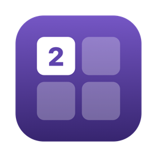
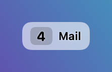

# DeskMap

[English](README.md) | **Русский**

Текущая версия: **0.1.0** — см. [Releases](../../releases) и [CHANGELOG](CHANGELOG.md).



Крошечная утилита для macOS, которая всегда показывает, **на каком десктопе (Space) вы находитесь** — номер десктопа в маленьком плавающем окошке и в меню-баре. Кликните по окошку, чтобы дать десктопу своё имя.

Сделана ради одной простой цели: когда десктопов много, нужна постоянная метка перед глазами «где я сейчас» — с именами, которые что-то значат («Почта», «Код», «Музыка»), а не с голыми номерами.

## Как это выглядит

| Обычный режим | Компактный | Контраст | Только номер |
|:---:|:---:|:---:|:---:|
|  |  |  |  |

Полупрозрачное плавающее окошко поверх рабочего стола; тот же номер живёт в меню-баре. Скриншоты рендерятся оффскрин с фейковыми данными скриптом `scripts/make-screenshots.sh` — реальное содержимое рабочего стола не участвует.

## Возможности

- **Плавающее окошко** — маленькая полупрозрачная плашка поверх всех окон, на всех десктопах, даже над полноэкранными приложениями. Перетаскивается куда угодно; позиция запоминается.
- **Клик — переименовать** — кликните по окошку, введите имя, нажмите Enter (Esc — отмена, пустое имя удаляет название). Имена запоминаются для каждого десктопа и переживают перезапуск.
- **Номер в меню-баре** — номер текущего десктопа также живёт в меню-баре; своё имя видно в подсказке и в выпадающем меню.
- **Переход к десктопу** — меню «Перейти к…» показывает все десктопы с номерами и именами; выберите — и окажетесь там. В окошке то же меню открывается кликом по номеру (клик по имени, как обычно, переименовывает). Переключение нажимает за вас клавиатурные шорткаты Mission Control: «Switch to Desktop N», если он включён в Системных настройках, иначе идёт стрелками Ctrl+←/→. Нужно разрешение Accessibility — macOS спросит при первом использовании.
- **Полноэкранные приложения** — это отдельные Spaces без номера; они показываются как «⛶».
- **Сквозная нумерация по дисплеям** — десктопы нумеруются так же, как их нумерует Mission Control; окошко показывает номер для того дисплея, на котором стоит.
- **Компактный режим** — ещё меньшее окошко: номер становится обычным текстом перед именем (`4 | Имя`), шрифт меньше, длинные имена подрезаются до 15 символов.
- **Только номер** — совсем спрятать имя и показывать одну цифру десктопа.
- **Все имена в одном месте** — окно «Настройки десктопов» показывает список всех десктопов с номерами и именами; редактировать можно все сразу. Кнопка «Добавить» дописывает строку для ещё не существующего десктопа — когда вы позже создадите десктоп с таким номером, он автоматически получит заготовленное имя.
- **Бегунок непрозрачности** — один бегунок в «Настройках интерфейса» меняет вид окошка от полной прозрачности до сплошной черноты; цвет текста подстраивается по ходу, чтобы всегда оставаться читаемым.
- **Режим «Контраст»** — переключатель в «Настройках интерфейса» переворачивает цветовую гамму: фон меняется от прозрачного к белому вместо чёрного, а текст подстраивается в противоположную сторону.
- **Выравнивание слева или справа** — при правом выравнивании номер переезжает на правую сторону от имени, а окошко держит правый край на месте и растёт влево при изменении размера содержимого. Удобно, когда окошко стоит у правого края экрана.
- **«Поверх всех окон»** — отдельный переключатель: со снятой галкой окошко ведёт себя как обычное окно и может перекрываться другими.
- **Всё запоминается** — имена, позиция окошка, компактный режим и «только номер», выравнивание, непрозрачность и видимость переживают перезапуск приложения.
- **Запуск при входе в систему** — переключатель в меню (системный `SMAppService`).
- **10 языков** — English (по умолчанию), Русский, Español, Deutsch, Français, Italiano, Português, 中文, 日本語, 한국어. Переключаются в меню.

## Приватность

DeskMap вообще не делает сетевых запросов. Имена десктопов хранятся локально в настройках приложения. Никаких аккаунтов, никакой аналитики — ничто не покидает ваш Mac.

## Установка (готовая сборка)

1. Скачайте `DeskMap.zip` со страницы [Releases](../../releases) и распакуйте.
2. Переместите `DeskMap.app` в `/Applications`.
3. Первый запуск: приложение не нотаризовано, поэтому обычный двойной клик macOS заблокирует. Либо **правый клик по приложению → Открыть → Открыть**, либо снимите карантинный флаг в Терминале:

   ```sh
   xattr -dr com.apple.quarantine /Applications/DeskMap.app
   ```

4. Ищите номер десктопа в меню-баре (если его не видно, меню-бар может быть переполнен — перетащите другие иконки с зажатым Cmd, чтобы освободить место). Плавающее окошко включается и выключается в меню.

Требуется macOS 13 Ventura или новее.

## Сборка из исходников

Требования: macOS 13+, Xcode Command Line Tools (`xcode-select --install`). Проект Xcode не нужен — это обычный Swift Package.

```sh
git clone <this repo>
cd mac-desktop-map
./build-app.sh
ditto build/DeskMap.app /Applications/DeskMap.app
```

`build-app.sh` собирает релизный бинарник через SwiftPM, заворачивает его в `.app`-бандл с иконкой (пересоздаётся скриптом `scripts/make-icon.sh`, если отсутствует) и подписывает ad-hoc подписью. Версия приложения берётся из `Sources/DeskMap/Version.swift` и показывается в диалоге «О программе».

Dev-вариант с дополнительной информацией в «О программе»: `./build-app.sh -dev`.

## Как это работает

- В macOS нет публичного API для Spaces, поэтому DeskMap использует те же приватные вызовы SkyLight, что и [WhichSpace](https://github.com/gechr/WhichSpace) с [yabai](https://github.com/koekeishiya/yabai) (`SLSMainConnectionID`, `SLSCopyManagedDisplaySpaces`, загружаются через `dlsym`). Считаются только обычные пользовательские десктопы; Spaces полноэкранных приложений пропускаются — в точности как в нумерации Mission Control.
- Обновления приходят из системного уведомления о смене активного Space, плюс редкий опрос — чтобы поймать перестановку десктопов в Mission Control (она уведомлений не шлёт).
- Свои имена привязаны к стабильному UUID каждого Space, поэтому имя остаётся с десктопом, даже когда его номер меняется.
- Окошко — это безрамочная неактивирующаяся `NSPanel` на плавающем уровне с SwiftUI-содержимым: клик по нему никогда не уводит фокус из текущего приложения.
